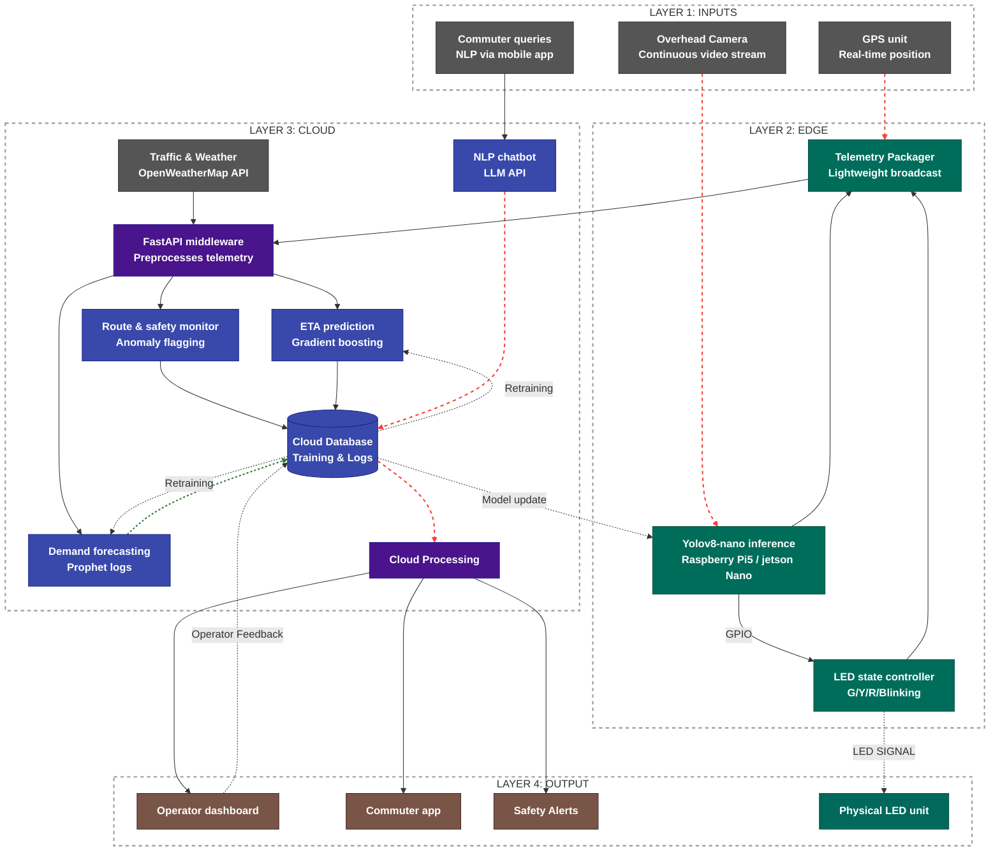

```mermaid
graph TD
    %% --- THEME DEFINITIONS ---
    classDef layerBox fill:none,stroke:#999,stroke-width:2px,stroke-dasharray: 5 5
    classDef inputNode fill:#555,stroke:#333,color:#fff,font-weight:bold
    classDef edgeNode fill:#006d5b,stroke:#014d3e,color:#fff,font-weight:bold
    classDef cloudNode fill:#4a148c,stroke:#311b92,color:#fff,font-weight:bold
    classDef serviceNode fill:#3949ab,stroke:#1a237e,color:#fff,font-weight:bold
    classDef outputNode fill:#795548,stroke:#3e2723,color:#fff,font-weight:bold
    classDef ledNode fill:#00695c,stroke:#004d40,color:#fff,font-weight:bold

    %% --- LAYER 1: INPUTS ---
    subgraph L1 [LAYER 1: INPUTS]
        direction LR
        GPS[GPS unit<br/>Real-time position]:::inputNode
        CAM[Overhead Camera<br/>Continuous video stream]:::inputNode
        QUE[Commuter queries<br/>NLP via mobile app]:::inputNode
    end

    %% --- LAYER 2: EDGE ---
    subgraph L2 [LAYER 2: EDGE]
        direction TB
        YOLO[Yolov8-nano inference<br/>Raspberry Pi5 / jetson Nano]:::edgeNode
        LED_C[LED state controller<br/>G/Y/R/Blinking]:::edgeNode
        TP[Telemetry Packager<br/>Lightweight broadcast]:::edgeNode
        
        YOLO -- GPIO --> LED_C
        YOLO --> TP
        LED_C --> TP
    end

    %% --- LAYER 3: CLOUD ---
    subgraph L3 [LAYER 3: CLOUD]
        direction TB
        TW[Traffic & Weather<br/>OpenWeatherMap API]:::inputNode
        FAST[FastAPI middleware<br/>Preprocesses telemetry]:::cloudNode
        
        ETA[ETA prediction<br/>Gradient boosting]:::serviceNode
        DEM[Demand forecasting<br/>Prophet logs]:::serviceNode
        RSM[Route & safety monitor<br/>Anomaly flagging]:::serviceNode
        NLP[NLP chatbot<br/>LLM API]:::serviceNode
        
        DB[(Cloud Database<br/>Training & Logs)]:::serviceNode
        CP[Cloud Processing]:::cloudNode

        FAST --> ETA & DEM & RSM
        TW --> FAST
        RSM & ETA & DEM & NLP --> DB
        DB --> CP
    end

    %% --- LAYER 4: OUTPUT ---
    subgraph L4 [LAYER 4: OUTPUT]
        direction LR
        OD[Operator dashboard]:::outputNode
        APP[Commuter app]:::outputNode
        SA[Safety Alerts]:::outputNode
        PLU[Physical LED unit]:::ledNode
    end

    %% --- CONSISTENT SPACING & POSITIONING ---
    %% Connecting the layers
    CAM --> YOLO
    GPS --> TP
    QUE --> NLP
    TP --> FAST
    CP --> OD & APP & SA
    
    %% Specific routing for the LED Signal
    LED_C -. LED SIGNAL .-> PLU

    %% --- FEEDBACK LOOPS (Red Dashed) ---
    DB -.->|Model update| YOLO
    OD -.->|Operator Feedback| DB
    DB -.->|Retraining| ETA
    DB -.->|Retraining| DEM

    %% --- STYLING ---
    class L1,L2,L3,L4 layerBox
    linkStyle 10,11,12,13 stroke:#f44336,stroke-width:2px,stroke-dasharray: 5 5
    linkStyle 9 stroke:#2e7d32,stroke-width:2px,stroke-dasharray: 3 3
```